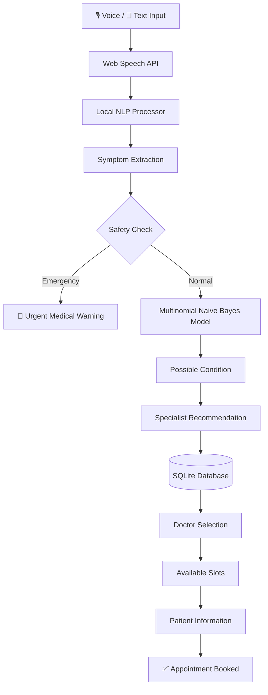

<div align="center">

# 🩺 Healthcare AI

### Local, API-Free Symptom Screening & Appointment Booking

Voice input → NLP symptom extraction → ML prediction → specialist recommendation → appointment booking, all running on your own machine.


</div>

> ⚠️ **Disclaimer:** This is an educational demonstration. It is **not** a medical diagnosis tool and is not a substitute for professional medical care. In an emergency, contact your local emergency services immediately.

---

## 📑 Table of Contents

- [Overview](#-overview)
- [Features](#-features)
- [How It Works](#-how-it-works)
- [Architecture](#-architecture)
- [Tech Stack](#-tech-stack)
- [Project Structure](#-project-structure)
- [Getting Started](#-getting-started)
- [Usage & Demo](#-usage--demo)
- [API Reference](#-api-reference)
- [Machine Learning Details](#-machine-learning-details)
- [NLP Details](#-nlp-details)
- [Database Schema](#-database-schema)
- [Safety Layer](#-safety-layer)
- [Limitations](#-limitations)
- [Troubleshooting](#-troubleshooting)
- [Future Scope](#-future-scope)
- [Contributing](#-contributing)
- [License](#-license)

---

## 📌 Overview

Many healthcare apps rely on paid AI APIs or heavy cloud infrastructure. **Healthcare AI** shows how a lightweight assistant can be built with purely **local technologies**.

A user can:

1. Describe symptoms by **voice or text**
2. Have symptoms **extracted locally** with rule-based NLP
3. Get **possible conditions** from a locally trained ML model
4. Receive a **specialist recommendation**
5. **Browse doctors** stored in a local database
6. **View available slots**
7. **Book an appointment** and receive a confirmation

No OpenAI, Gemini, or other cloud AI service is required.

---

## ✨ Features

| Feature | Description |
|---|---|
| 🎙️ **Voice Input** | Speak symptoms using the browser's Web Speech API |
| 🧠 **Local NLP** | Regex/rule-based extraction of symptoms from natural language |
| 🤖 **ML Prediction** | Multinomial Naive Bayes classifier trained on a local dataset |
| 👨‍⚕️ **Specialist Mapping** | Predicted condition → relevant specialist category |
| 🗄️ **SQLite Storage** | Doctors, slots, appointments, and symptom history |
| 📅 **Booking Flow** | Select doctor → pick slot → enter details → confirm |
| 🚨 **Emergency Check** | Detects dangerous combinations and halts the normal flow |
| 🔒 **Privacy-Friendly** | Core pipeline runs fully offline once dependencies are installed |

---

## 🏗️ How It Works



---

## 🧩 Architecture

**1. Frontend** (HTML, CSS, JavaScript, Web Speech API)
Handles the UI, voice and text input, prediction display, doctor and slot selection, the booking form, and confirmation.

**2. Backend** (Python, FastAPI, Pydantic)
Exposes REST endpoints for prediction, doctors, slots, and appointments.

**3. Data & ML Layer** (Pandas, scikit-learn, Joblib, SQLite)
Trains and serves the classifier and manages all persistent data.

---

## 🛠️ Tech Stack

| Layer | Technology |
|---|---|
| Frontend | HTML, CSS, JavaScript |
| Voice | Web Speech API |
| Backend | Python, FastAPI, Pydantic |
| NLP | Python regex / rule-based |
| ML | scikit-learn (Multinomial Naive Bayes) |
| Data Processing | Pandas |
| Model Storage | Joblib |
| Database | SQLite |
| API Style | REST |

---

## 📂 Project Structure

```text
Healthcare-AI/
├── backend/
│   ├── data/
│   │   └── symptoms_dataset.csv
│   ├── models/
│   │   ├── disease_classifier.joblib
│   │   └── mlb.joblib
│   ├── database.py          # SQLite connection & queries
│   ├── nlp_processor.py     # Rule-based symptom extraction
│   ├── predictor.py         # Loads model, returns predictions
│   ├── seed_data.py         # Creates DB, seeds doctors & slots
│   ├── test_pipeline.py     # Pipeline test script
│   └── train_model.py       # Trains and saves the classifier
├── frontend/
│   ├── app.js
│   ├── index.html
│   └── style.css
├── main.py                  # FastAPI entry point
├── .gitignore
└── README.md
```

---

## 🚀 Getting Started

### Prerequisites

- Python 3.9 or newer
- A modern browser (Chrome or Edge recommended for voice input)

### 1. Clone the repository

```bash
git clone https://github.com/YOUR_USERNAME/Healthcare-AI.git
cd Healthcare-AI
```

### 2. Create and activate a virtual environment

**Windows (PowerShell)**
```powershell
python -m venv venv
.\venv\Scripts\Activate.ps1
```

**macOS / Linux**
```bash
python3 -m venv venv
source venv/bin/activate
```

### 3. Install dependencies

```bash
pip install fastapi uvicorn pandas scikit-learn joblib pydantic
```

### 4. Initialize the database

```bash
python backend/seed_data.py
```

Creates the local SQLite database and seeds doctors and appointment slots.

### 5. Train the model

```bash
python backend/train_model.py
```

Generates `backend/models/disease_classifier.joblib` and `backend/models/mlb.joblib`.

### 6. Run the backend

From the project root:

```bash
python -m uvicorn main:app --reload
```

- API: http://127.0.0.1:8000
- Interactive docs (Swagger): http://127.0.0.1:8000/docs

### 7. Run the frontend

In a **second terminal**:

```bash
python -m http.server 5500 --directory frontend
```

Open http://127.0.0.1:5500

---

## 🧪 Usage & Demo

**Normal flow.** Enter:

```text
I have a headache, nausea and I have been vomiting since morning.
```

The app will:

1. Extract `headache`, `nausea`, `vomiting`
2. Run the ML prediction
3. Show the possible condition
4. Recommend a specialist
5. List matching doctors
6. Show available slots
7. Book your appointment

**Emergency flow.** Enter:

```text
I have chest pain and difficulty breathing.
```

The normal screening is stopped and an urgent medical warning is shown instead.

---

## 🔌 API Reference

| Method | Endpoint | Description |
|---|---|---|
| `GET` | `/` | Root / welcome |
| `GET` | `/health` | Health check |
| `POST` | `/predict` | Extract symptoms and predict possible conditions |
| `GET` | `/doctors` | List doctors (optionally by specialization) |
| `GET` | `/doctors/{doctor_id}/slots` | Available slots for a doctor |
| `POST` | `/appointments` | Book an appointment |

Full request/response schemas are available at `/docs` while the server is running.

---

## 🤖 Machine Learning Details

- **Model:** Multinomial Naive Bayes
- **Features:** Binary symptom indicators
- **Split:** Manual 75/25 train-test split
- **Storage:** Joblib artifacts in `backend/models/`

**Demo dataset**

| Rows | Symptom features | Condition classes |
|---|---|---|
| 39 | 20 | 10 |

**Symptom features:** `fever`, `cough`, `fatigue`, `headache`, `sore_throat`, `runny_nose`, `shortness_of_breath`, `chest_pain`, `wheezing`, `dizziness`, `nausea`, `vomiting`, `skin_rash`, `itching`, `joint_pain`, `muscle_ache`, `palpitations`, `loss_of_appetite`, `high_fever`, `chills`

**Condition → Specialist mapping (examples)**

| Condition | Specialist |
|---|---|
| Common Cold, Flu, Malaria | General Physician |
| Acne, Eczema | Dermatologist |
| Asthma, Bronchitis | Pulmonologist |
| Hypertension, Coronary Artery Disease | Cardiologist |
| Migraine | Neurologist |

---

## 🧠 NLP Details

Symptom extraction uses predefined patterns and regular expressions, with no external AI service.

| User says | Mapped to |
|---|---|
| "my head hurts" | `headache` |
| "throwing up" | `vomiting` |

Benefits: **local, fast, API-free, and easy to understand and demo.**

---

## 🗄️ Database Schema

| Table | Stores |
|---|---|
| `doctors` | Name, specialization, hospital, contact, consultation fee |
| `slots` | Doctor, date, start time, end time, booking status |
| `appointments` | Patient name, contact, doctor, slot, predicted condition, symptoms, created timestamp |
| `symptom_history` | Record of submitted symptoms |

---

## 🚨 Safety Layer

The frontend runs an emergency check before any prediction. Combinations such as **chest pain + difficulty breathing** immediately stop the screening flow and display an urgent warning. Emergency cases are never treated as ordinary prediction requests.

---

## ⚠️ Limitations

- The dataset is **tiny (39 rows)** and not medically validated, so predictions are illustrative only.
- NLP is rule-based and recognizes only predefined phrases.
- The emergency check covers a limited set of combinations.
- Voice input depends on browser support for the Web Speech API (best in Chrome/Edge; some browsers send audio to a cloud service for recognition).
- No authentication or user accounts.

---

## 🧰 Troubleshooting

| Problem | Fix |
|---|---|
| `ModuleNotFoundError` | Activate the virtual environment and re-run the `pip install` command |
| Prediction fails / model not found | Run `python backend/train_model.py` first |
| No doctors or slots appear | Run `python backend/seed_data.py` |
| Frontend can't reach the API | Make sure the backend is running on port 8000 and CORS allows your frontend origin |
| Microphone doesn't work | Use Chrome or Edge, allow mic permission, and open via `http://127.0.0.1` / `localhost` |
| PowerShell blocks activation | Run `Set-ExecutionPolicy -Scope Process -ExecutionPolicy Bypass` and retry |

---

## 🔮 Future Scope

- Larger, medically validated datasets
- Transformer-based symptom understanding
- Multilingual voice input
- Authentication, plus doctor and patient dashboards
- Appointment cancellation and rescheduling
- Medical record management
- More advanced emergency detection
- Explainable ML predictions
- Cloud deployment and a mobile app

---

## 🤝 Contributing

Contributions are welcome.

1. Fork the repository
2. Create a branch: `git checkout -b feature/your-feature`
3. Commit your changes: `git commit -m "Add your feature"`
4. Push: `git push origin feature/your-feature`
5. Open a Pull Request

---

## 📄 License

Add your preferred license here (for example, MIT) and include a `LICENSE` file in the repository.

---

## ⚠️ Medical Disclaimer

Healthcare AI is an educational project. Its predictions come from a small demonstration dataset and must **not** be treated as medical advice, diagnosis, or treatment. For real medical concerns, consult a qualified healthcare professional.

---

<div align="center">

**Healthcare AI** is a college project combining Voice Recognition, NLP, Machine Learning, FastAPI, SQLite, and Appointment Management into a local, API-free demonstration.

</div>
